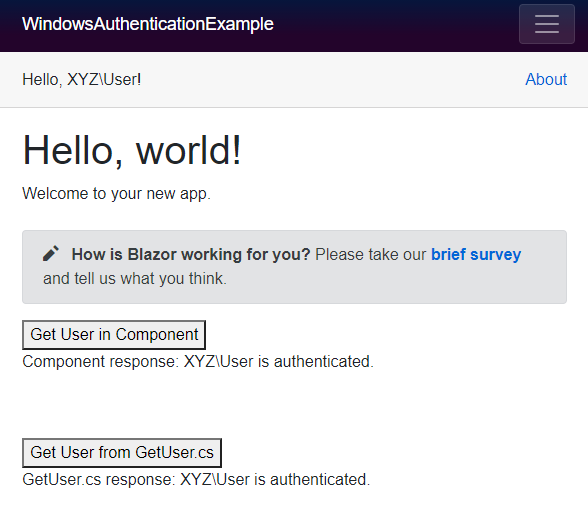
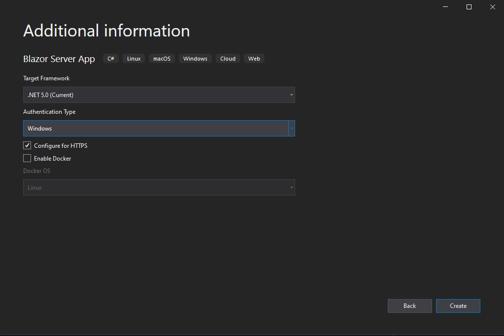

*https://docs.microsoft.com/en-us/aspnet/core/blazor/security/?view=aspnetcore-5.0*

### Demonstrated ways to get logged in user, using windows authentication:
* IHttpContextAccessor
* AuthenticationStateProvider
* The template project also display the username simply using (LoginDisplay.razor):
<AuthorizeView>
    Hello, @context.User.Identity.Name!
</AuthorizeView>

### Files changed/created:
* Data -> GetUser.cs
* Startup.cs
  * services.AddHttpContextAccessor(); to Dependency inject IHttpContextAccessor
  * add class created so that it can be injected for usage on index.razor
* Pages -> Index.razor

### If you're have a project and want to add windows authentication, if should be enough to edit the file 'Properties -> launchSettings.json'
`{
  "iisSettings": {
    "windowsAuthentication": true,
    "anonymousAuthentication": false,
    ...
  },`

### When creating a new project you can enable the authentication type:

